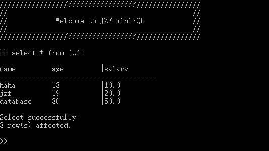
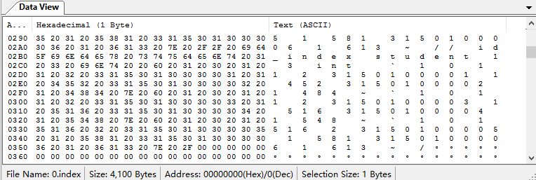

# 1. OVERVIEW
*MiniSQL*, as its name reveals, is a **light weight database management system** in **SQL**.
As a homework assigned in the **database system** course for sophomore majoring in CS,
it is an **individual project** for **non-comercial** purposes.
This system allows you to manage databases in simple SQL statement,
and these databases are supposed to store in your computers locally.
  
  

# 2. FUNCTIONS
## Overall
This system allows users to create or delete a **table**, an **index** or a **record** 
by interacting with the textual interface with SQL statements.  
In addition, it can also process the corresponding batch files.  

## Supporting data types
**INT**, **CHAR(N)** and **FLOAT** are included.  

## About table
Each attribute in a table can be defined as either a **unique** one or a common one.  
Also, assignment of a **single primary key** is surported.  

## About index
Indexes are implemented through the data structure of **B plus trees**.  
Users can add an index based on the **primary key** in a table.  

## About record
Users are able to select, insert or delete severals records in a table.  
Additionally, in the select statement, conditions can be combined with word **and**,  
and both **equality** queries and **interval** queries are supported.  

# 3. ARCHITECTURE
My MiniSQL's architecture takes the advantage of the **traditional** one. The connections
of its components are shown as follows:

  

- **Interpreter**: serves as a bridge between users and the kernel of the system. To be exact
it contains the textural interaction interface with friendly prompts and information, as 
well as interpretion from SQL statements to internal commands.
- **API**: the entrance of the kernel of the system, which distributes internal commands from
 interpreter to three main modules - index, record and catalog manager.  
- **Catalog manager**: construct a meta table, which stores the logical structure of 
all the existing tables.
- **Record manager**: provide interfaces for record operation.  
- **Index manager**: provide interfaces for index operation based on B plus tree.
- **Buffer manager**: stimulates the behavior of a common operating system. 
That is, it attempts to reduce the accesses to disks by using allocating some space 
in the memory as a buffer pool, which contains of lots of pages.  The memory management 
algorithm is *FIFO*, i.e. always discard the unpinned page that was the first to be used 
among all pages in the pool.  

Particularly, Recorder Manager, Index Manager and Catalog Manager are NOT designed to 
read or write the database files directly for the sake of **physical independence**.  
Only with the aid of **Buffer Manager** can they accomplish the I/O tasks.  
Furthermore, these three modules will NOT call one another, and the underlying Buffer 
Manager will NOT call these three modules.

# 4. USAGE
Make sure that the consistence of relative paths among all the folders.
##  The hierarchy of the file:
- MiniSQL: source code
- catalog: catalog files
- record: record files
- index: index files
- execFile: files that can exec in MiniSQL
- images: images used in readme  

## How to build the project
One can build it readily by creating an empty C++ project and adding all 
the source code files, i.e. \*.cpp, \*.h before compiling.  
The executive file is expected to locate in the very folder named MiniSQL.  

##  To exemplify, following are snapshots of some sequential operations:
- Create a table  
  
- Insert several records  
  
- Create an index on the table  
   
*p.s. The result of the modification that happens in the underlying file can be seen as follows:*  
  
- Equality select  
  
- Range select  
  
- Delete the index  
  
*The result of the modification that happens in the underlying file can be seen as follows:*  
  
*p.s. Through lazy deletion, only the labels of the specific index has been changed.*  
- Delete several records  
  
- Delete the table  
  
- File execution  
The sample file contents:  
```
create table teacher  
(name char(8) unique,  
age int,  
salary float,  
primary key(name));  
  
insert into teacher values  
('Steven', 34, 100000.0),  
('Taylor', 23, 32000.0),  
('Ultra', 44, 200000.0),  
('Victor', 45, 180000.0);  
  
select * from teacher;  
  
select * from teacher where name = 'Ultra';  
  
select * from teacher where age > 30 and age <= 44;  
  
select * from teacher where salary <> 32000.0;  
  
create index name_index on teacher(name);  
  
drop index name_index;  
  
delete from teacher where age < 35;  
  
drop table teacher;  
  
quit  
```  
And the result can be seen as follows:  
  
  
  
  
# 5. LICENCE
The content of all the codes are supposed to use a licence [AGPLv3](./LICENCE)  

# 6. HOW TO CONTRIBUTE
1. Learn what is a AGPLv3, if you have not yet done so (see details above).  
2.  Create your change to the repo in question.
- Fork the desired repo, develop and test your code changes.
- Ensure that your code is clear and comprehensible.
- Ensure that your code has an appropriate set of unit tests which all pass.
3. Submit a pull request.
4. The repo owner will review your request. If it is approved, the change will be merged. If it needs additional work, the repo owner will respond with useful comments.

# 7. CREDIT
First of all, I would like to extend my sincere gratitude to my supervisor, Yunjun Gao, for his instructive advice and useful suggestions on my learning on database system.   
I am also deeply grateful of Keyu Yang, the TA's help in the completion and assessment of this project.  
High tribute shall be paid to Jinhong Li and Jiang Wu, whose profound knowledge of MiniSQL triggers my inspiration for this brilliant project.  
